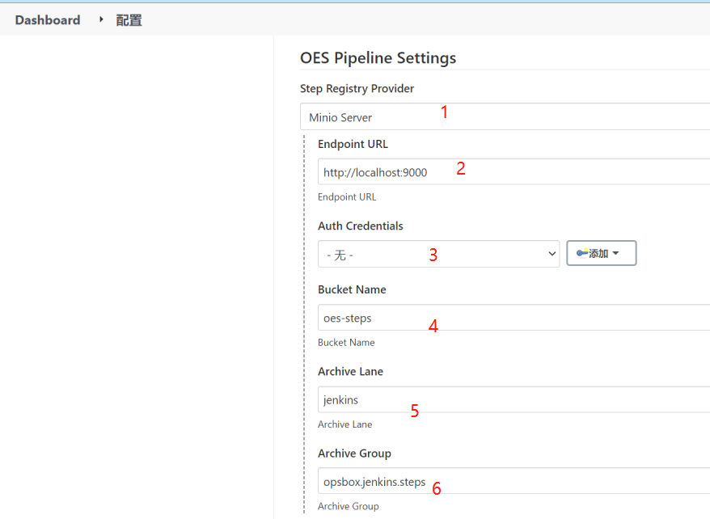
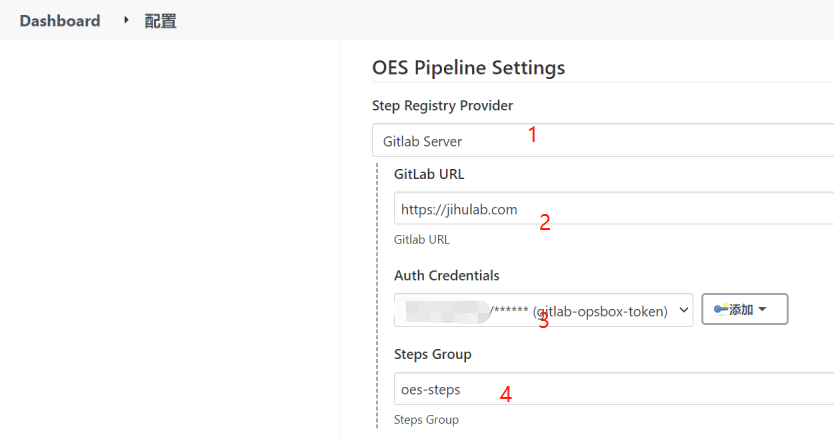

# oes-pipeline plugin

A plugin that uses Apache Ant to extend Jenkins' building capabilities.

# Usage

Using the free-style project, add the OES Pipeline build step and paste the following configuration into the text box.

## Two writing methods are supported

1. The syntax is similar to wercker

```yaml
environment:
  JENKINS: jenkins

pipeline:
  - name: build
    steps:
      - script: 
          code: |
            echo "hello, $JENKINS"
```

2. The syntax missing one layer of indentation

```yaml
environment:
  JENKINS: jenkins

pipeline:
  - name: build
    steps:
      - step.id: script 
        code: |
          echo "hello, $JENKINS"
```

## A complete build pipeline configuration

This process includes build, package, and deploy, many plugins are used, such as maven, Script, Dapper, Kubectl, Ansible

```yaml
environment:
  DOCKER_REG: registry.cn-hangzhou.aliyuncs.com
  DOCKER_AUTH: secret://jenkins/usernamePassword/aliyun-acr-chengdu
  KUBECONFIG: secret://jenkins/secretFile/kubeconfig-xxx-k8s-online
  APP_GROUP: k8ops
  APP_NAME: java-docker-sample
  APP_VERSION: 1.0.0
  TARGET_PATH: sample-service/target

pipeline:
  - name: build
    environment:
      DOCKER_REG: registry.cn-chengdu.aliyuncs.com
      DOCKER_AUTH: secret://jenkins/usernamePassword/opsbox-acr-auth
    steps:
      - maven:
          toolenv: docker
          toolenv.img: k8ops/jenkins-build:maven-java8u201
          options: clean package -Dmaven.test.skip=true
          settings.id: opsbox
      - inject-scripts
      - script:
          code: |
            mkdir -p dist/lib
            cp -r ${TARGET_PATH}/*.jar dist/lib/
            cp -r .oes/run/inject-scripts/spring/bin dist/
            cp -r .oes/run/inject-scripts/spring/Dockerfile ./
      - docker:
          dockerfile: Dockerfile
          build.tag: ${env.DOCKER_REG}/opsbox/${env.APP_GROUP}:${env.APP_NAME}-v${env.APP_VERSION}
      - package:
          fileset.dir: dist
          chmod.includes: bin/*.sh
          
  - name: deploy
    steps:
      - kubectl:
          image: ${env.DOCKER_REG}/opsbox/${env.APP_GROUP}:${env.APP_NAME}-v${env.APP_VERSION}

  - name: ecs-deploy
    environment:
      DOCKER_REG: registry.cn-chengdu.aliyuncs.com
      DOCKER_AUTH: secret://jenkins/usernamePassword/opsbox-acr-auth
      ALIOSS_ENDPOINT: oss-cn-chengdu-internal.aliyuncs.com
    steps:
      - ansible:
          inventory: 192.168.0.101,
          options: >-
            -e run_as_user=root
            -e service_manager=supervisor
            -e service_name=${env.APP_NAME}
            -b -v
```

# Jenkins Pipeline Syntax

```groovy

pipeline {

    agent any

    options {
        disableConcurrentBuilds()
        skipDefaultCheckout true
    }

    environment {
        APP_GROUP = 'opsbox'
        APP_NAME = 'java-docker-sample'
        APP_VERSION = '1.0.0' // This can be used with the oes-template plugin to implement flexible version numbers through variables
    }

    stages{

        stage("Checkout Code") {
            steps {
                script {
                    deleteDir()
                    cleanWs()
                    def branch = purgeBranchString(code.branch) // This 'code' imports variable objects using the oes-template plugin
                    git branch: "${branch}", credentialsId: "${code.auth}", url: "${code.url}"
                }
            }
        }

        stage("build") {
            environment {
                DOCKER_AUTH = credentials("${build.docker_auth}")
                DOCKER_REG  = "${build.docker_reg}"
                TARGET_PATH = "${build.target_path}"
            }
            steps {
                oesStep stepId: "maven",
                        stepProps: [
                                stepProp(key: "toolenv", value: "docker"),
                                stepProp(key: "toolenv.img", value: "k8ops/jenkins-build:maven-java8u201"),
                                stepProp(key: "options", value: "clean package -Dmaven.test.skip=true"),
                                stepProp(key: "settings.id", value: "opsbox")
                        ]
                
                oesStep stepId: "inject-scripts"

                sh '''
                    set -eux
                    mkdir -p dist/lib
                    cp -r ${TARGET_PATH}/*.jar dist/lib/
                    cp -r .oes/run/inject-scripts/spring/bin dist/
                    cp -r .oes/run/inject-scripts/spring/Dockerfile ./
                '''

                oesStep stepId: "package",
                        stepProps: [
                                stepProp(key: "fileset.dir", value: "dist"),
                                stepProp(key: "chmod.includes", value: "bin/*.sh")
                        ]
            }
        }
        
        stage("deploy") {
            environment {
                KUBECONFIG = credentials("kubeconfig-xxx-k8s-online")
            }
            steps {                
                oesStep stepId: "kubectl",
                        stepProps: [
                                stepPropp(key: "image", value: '${env.DOCKER_REG}/opsbox/${env.APP_GROUP}:${env.APP_NAME}-v${env.APP_VERSION}')
                        ]
            }
        }
    }
}

def purgeBranchString(branch) {

    def gitBranch = branch

    if (gitBranch?.startsWith("refs/heads/")) {
        gitBranch = gitBranch.replace("refs/heads/", "")
    }

    if (gitBranch?.startsWith("refs/tags/")) {
        gitBranch = gitBranch.replace("refs/tags/", "")
    }

    return gitBranch
}

```

# Extend the task pack provider

Currently, there are two ways to obtain an extension pack

1. Object storage, minio service



Configuration to explain:
  1. Select the extension pack source, Select Minio Server here
  2. Enter the minio server address
  3. Enter minio server authentication
  4. Enter minio server bucket
  5. Enter archive lane, it is a directory name
  6. Enter archive Group, It is also a directory name, 
     But you need to change the directory '/' to a dot,
     When the configuration is step.id=sample, the default will go to the 
     '/${archive lane}/${archive group}/${step id}' directory of the bucket 
     to obtain the extension package under the latest folder in the following version directory,
     such as: /jenkins/opsbox/jenkins/steps/sample/1.0.0/sample-1.0.0.tar.gz

2. Git warehouse, GitLab service



Configuration to explain:
  1. Select the extension pack source
  2. Fill in the address of the GitLab type service, such as: jihulab.com
  3. Obtain the Token in the GitLab service and create usernamePassword credentinal in Jenkins, then select here
  4. Set the GitLab Group where the built-in extension resides, 
     When the value of step.id is configured, step=sample, then the repository 
     under this group will be obtained and downloaded as an extension package.
     If step.id=opsbox-steps/sample@develop, then the repository 
     under the group of opsbox-steps will be obtained The develop branch 
     of the sample as an extension package